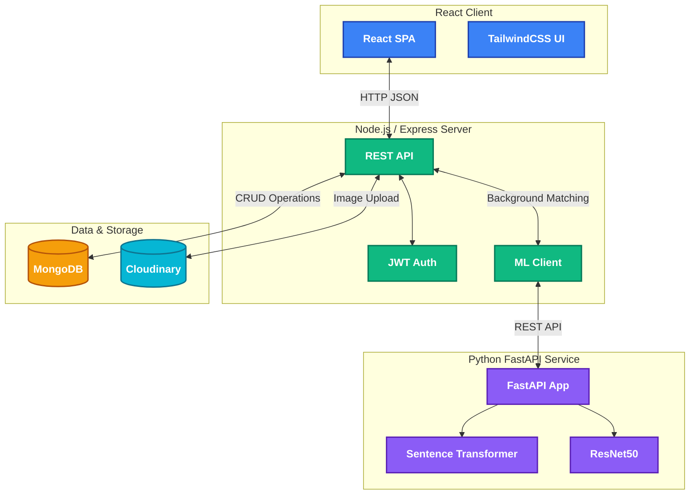

# Smart Lost & Found System

A production-grade full-stack web application designed to reconnect people with their lost belongings using AI-powered matching.

## Features

- **Modern & Premium UI/UX:** Built with React, TailwindCSS, and Framer Motion for beautiful, fluid interactions.
- **Secure Authentication:** JWT-based user authentication and secure password hashing.
- **AI Matching System:** Uses a Python microservice with **Sentence Transformers** (text) and **ResNet50** (images) to compute a combined Cosine Similarity score for finding matches.
- **Image Uploads:** Cloudinary integration for robust, optimized image handling.
- **Responsive Dashboard:** View, filter, search, and manage your reported items and view potential AI matches.

## System Architecture



## Folder Structure

- `/client` - React frontend powered by Vite and TailwindCSS.
- `/server` - Express.js backend handling REST APIs, Auth, and database interactions.
- `/ml-service` - Python FastAPI microservice that processes embeddings and performs similarity scoring.

## Quick Start & Setup

### Prerequisites
- Node.js (v18+)
- Python (3.10+)
- MongoDB (Running locally on `mongodb://localhost:27017` or use MongoDB Atlas)
- Cloudinary Account (For image uploads)

### 1. Setup the Server (Backend)

1. Open a terminal and navigate to the `server` directory:
   ```bash
   cd server
   ```
2. Install dependencies:
   ```bash
   npm install
   ```
3. Update your `.env` file in the `server` directory. Make sure to input your **Cloudinary Credentials**:
   ```
   CLOUDINARY_CLOUD_NAME=your_cloud_name
   CLOUDINARY_API_KEY=your_api_key
   CLOUDINARY_API_SECRET=your_api_secret
   ```
4. Start the server in development mode:
   ```bash
   npm run dev
   ```
   *The server will run on http://localhost:5000*

### 2. Setup the ML Microservice

1. Open a new terminal and navigate to the `ml-service` directory:
   ```bash
   cd ml-service
   ```
2. Create and activate a Python virtual environment (recommended):
   ```bash
   python -m venv venv
   # On Windows:
   venv\Scripts\activate
   # On Mac/Linux:
   source venv/bin/activate
   ```
3. Install the dependencies:
   ```bash
   pip install -r requirements.txt
   ```
4. Run the FastAPI application:
   ```bash
   python main.py
   ```
   *The ML service will run on http://localhost:8000. It will download the ResNet50 and MiniLM models on first startup.*

### 3. Setup the Client (Frontend)

1. Open a third terminal and navigate to the `client` directory:
   ```bash
   cd client
   ```
2. Install dependencies:
   ```bash
   npm install
   ```
3. The `.env` file is already set up to point to the backend (`VITE_API_URL=http://localhost:5000/api`).
4. Start the frontend:
   ```bash
   npm run dev
   ```
   *The frontend will be accessible at http://localhost:5173*

## Usage Guide

1. Sign up as a new user.
2. Report a "Lost" item (upload an image for the best match results).
3. Report a similar "Found" item to trigger the background ML matching process.
4. Check the **Matches** tab on your Dashboard to view potential AI matches!
